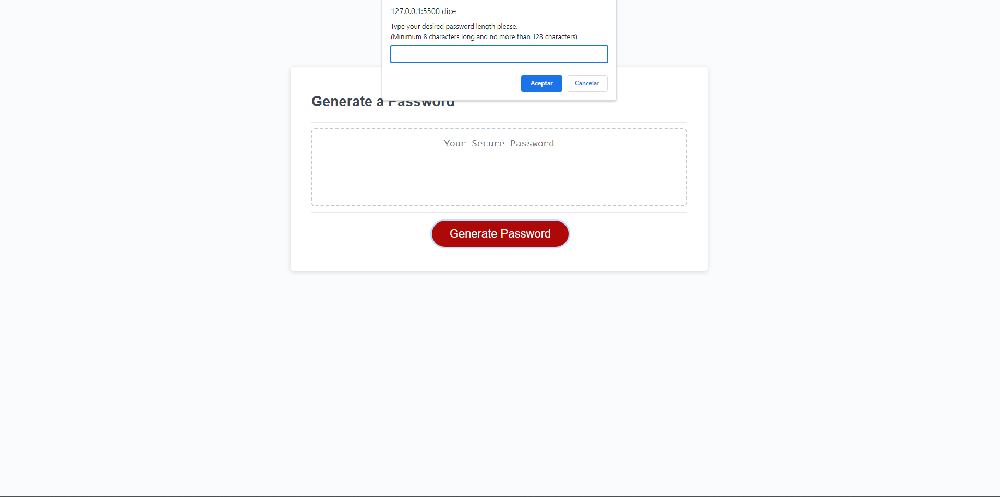

# Password-Gen

This application will generate a random password according to fit the user needs.
I tried 2 solutions to create this code.

*    The first solution has a static approach that matches the Acceptance criteria based on the user story.
*    The second solution has an automated version of the code using arrays, objects and checkbox for the GUI.

For the deployed version I created a function to add characters to an array depeding on the ASCII Code.

I like this way of selecting which characters are going to be use for the password since I need to update character ascii code I can just change the parameters on the function.

This challenge was pretty challenging, specially the automated version of the code, I had to learn about Objects and arrays, in order for it to work.

URL to the deployed web application:

